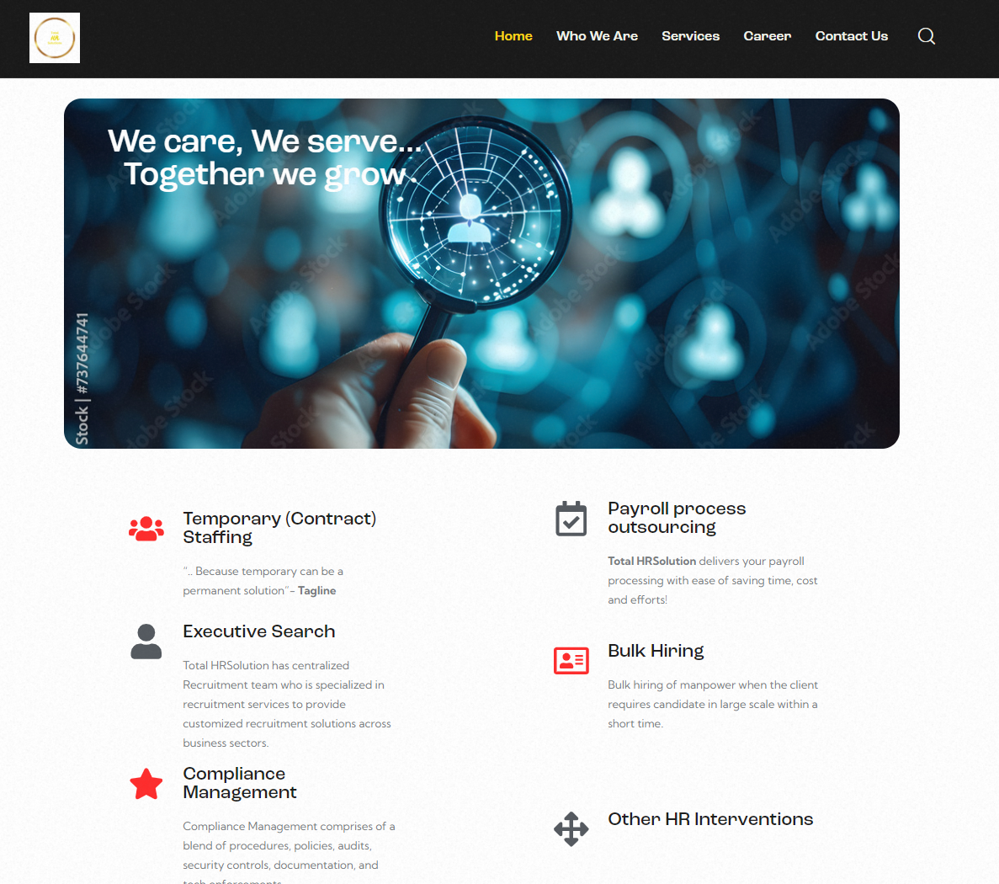
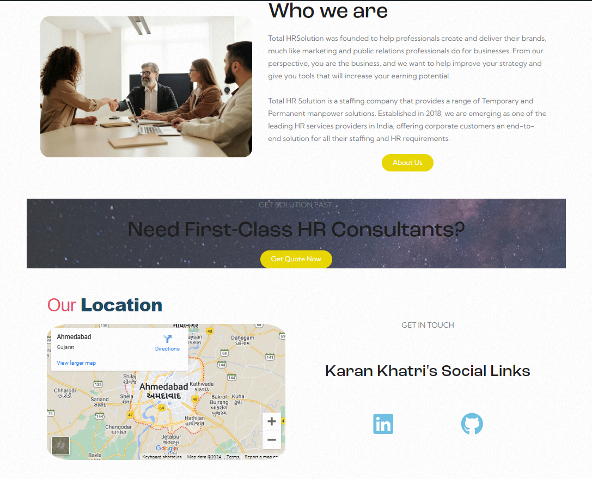
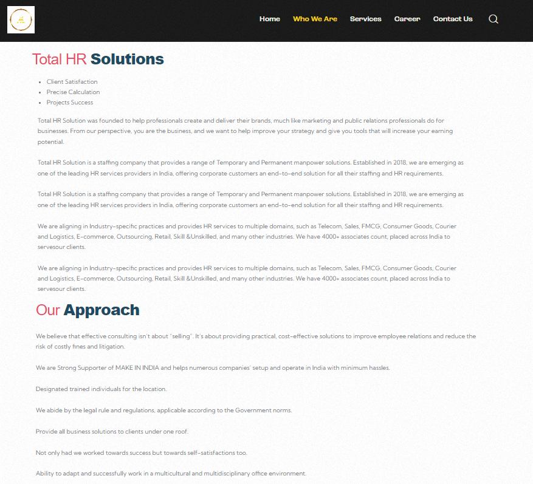
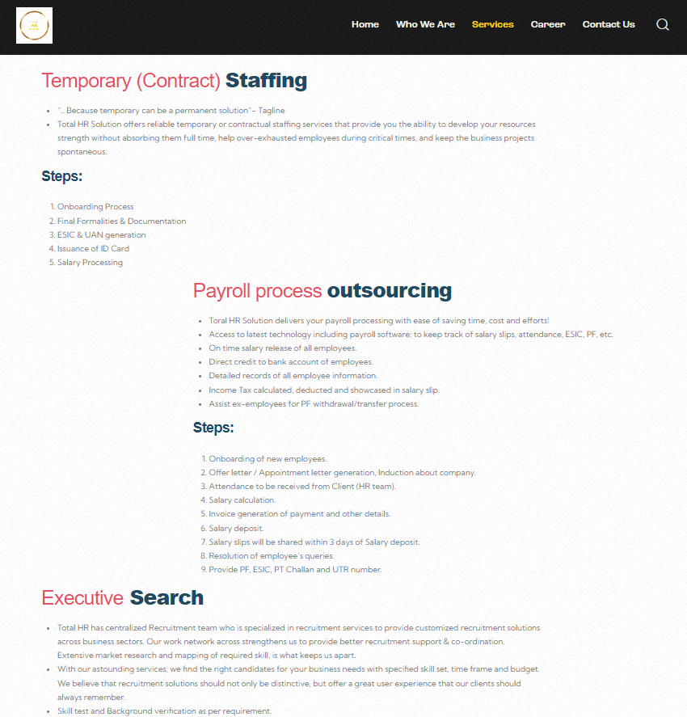
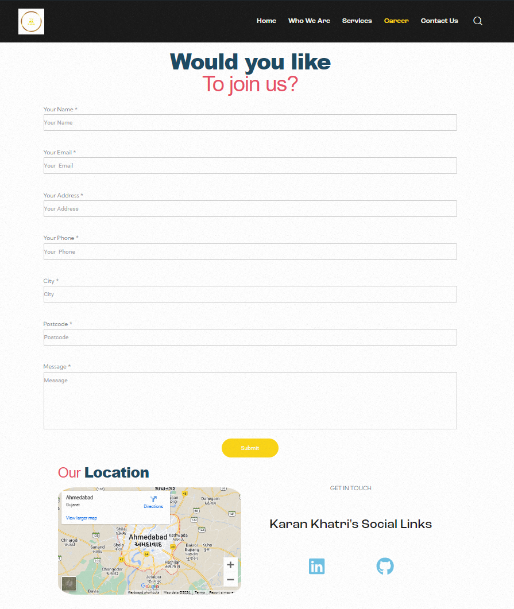
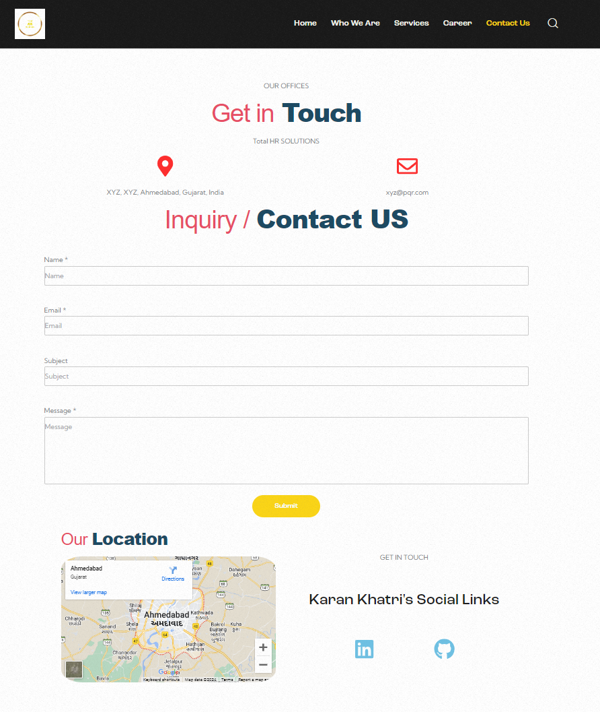

  <h1>Total HR Solutions</h1>
  
  

    Total HR Solutions is a comprehensive HR management platform designed to streamline and manage all HR-related tasks. 
  
 

<!-- Table of Contents -->
# Table of Contents

- [About the Project](#about-the-project)
  * [Screenshots](#screenshots)
  * [Tech Stack](#tech-stack)
- [License](#license)
- [Contact](#contact)
- [Acknowledgements](#acknowledgements)
  

<!-- About the Project -->
## About the Project

Total HR Solutions is a comprehensive HR management platform designed to streamline and manage all HR-related tasks. Built using WordPress, this website offers a range of features to facilitate employee management, payroll processing, recruitment, and more. The platform aims to provide an efficient and user-friendly interface for HR professionals.

<!-- Screenshots -->
### Screenshots

 
  
  
  
  
  
  

<!-- TechStack -->
### Tech Stack

  <ul>
    <li><a href="https://wordpress.org/">WordPress</a></li>
    <li><a href="https://www.php.net/">PHP</a></li>
  </ul>

<!-- License -->
## License

This project is licensed under the MIT License - see the [LICENSE](LICENSE) file for details.

<!-- Contact -->
## Contact

Karan Khatri - [LinkedIn](https://www.linkedin.com/in/karan-r-khatri/)

Project Link: [https://github.com/Karan6354/Total_HR_Solutions](https://github.com/Karan6354/Total_HR_Solutions)

<!-- Acknowledgments -->
## Acknowledgements

I would like to thank the following resources that have made this project possible:

- **[WordPress](https://wordpress.org/)**: WordPress provided a versatile and robust platform for building our website. Its flexible content management system (CMS) and extensive plugin ecosystem allowed us to efficiently develop and manage a wide range of HR services. The customizable themes and intuitive interface greatly enhanced our workflow and the overall user experience of the application.

I am grateful for these tools and the developers behind them for their contributions to the open-source community. Their support and continuous development have significantly enhanced our project's success.

